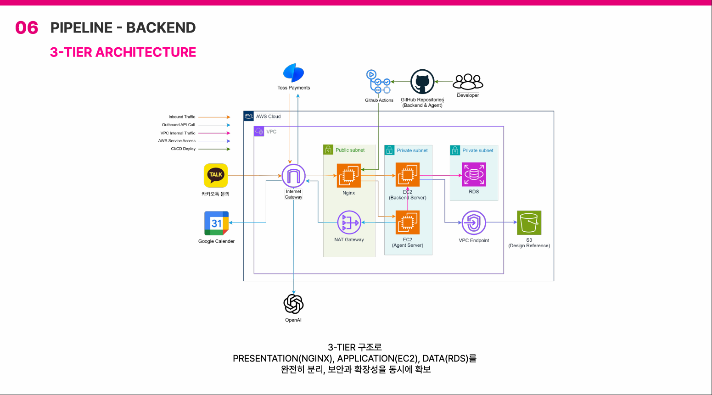

<div align="center">


# 💅 Reservia

**고객의 비정형 예약 메시지를 구조화하여**<br>
**예약 문의, 변경, 취소, 결제 확인, 일정 등록까지 자동 처리하는**<br>
**네일샵 사장님을 위한 AI 예약 응대 매니저**

<br>


<br>

**Team Nailgent**

26-1 데이터종합분석 캡스톤 프로젝트 &nbsp;·&nbsp; 🏆 2026 Low-Code AI Challenge Hackathon **3rd place**

</div>

<br>

---

## 프로젝트 소개

1인 네일샵 사장님은 시술 중에도 카카오톡으로 쏟아지는 예약 문의를 일일이 확인하고 답해야 합니다.

```
고객: 내일 오후 3시에 젤 제거하고 젤네일 가능해요? 첫방문이고 이름은 김지수예요.
```

Reservia는 이런 자유로운 자연어 메시지에서 예약에 필요한 정보를 추출하고,<br>
**예약 가능 여부 확인 → 누락 정보 재질문 → 예약금 결제 → Google Calendar 등록**까지 사장님 개입 없이 자동으로 처리합니다.

이 레포지토리는 **Reservia의 백엔드 서버**입니다.<br>
AI 에이전트(n8n + LangGraph)와 사장님 관리 대시보드(Frontend) 사이에서 예약·고객·결제·샵 설정 관리를 위한 **REST API**를 제공합니다.

<br>

---

## 인프라 아키텍처

AWS 위에 **3-Tier Architecture** 기반으로 구성되어 있습니다.

| Tier | 구성 | 설명 |
|------|------|------|
| **Presentation** | Nginx (Public Subnet) | 클라이언트 요청을 받아 내부 서버로 전달하는 리버스 프록시 |
| **Application** | EC2 Backend + EC2 Agent (Private Subnet) | 비즈니스 로직 처리 — Spring Boot 백엔드 및 AI 에이전트 서버 |
| **Data** | RDS MySQL + S3 (Private Subnet) | 데이터 저장 — 예약·고객·결제 DB 및 이미지 스토리지 |

<br>



<br>

| 구성 요소 | 역할 |
|-----------|------|
| **Nginx** (Public Subnet) | 리버스 프록시, HTTPS 처리 |
| **EC2 — Backend** (Private Subnet) | Spring Boot 백엔드 서버 |
| **EC2 — Agent** (Private Subnet) | n8n 기반 AI 에이전트 서버 |
| **RDS** (Private Subnet) | MySQL 데이터베이스 |
| **S3** | 고객 디자인 레퍼런스 이미지 저장 |
| **NAT Gateway** | Private Subnet → 외부 API 아웃바운드 통신 |
| **GitHub Actions** | main 브랜치 푸시 시 자동 배포 (CI/CD) |

<br>

---

## 주요 기능

### 📅 예약 관리
- AI 에이전트가 고객과 카카오톡으로 대화 → 예약 자동 생성
- 예약 생성·수정·삭제 시 **Google Calendar 일정 자동 동기화**
- 예약 상태 흐름: `PENDING` → `CONFIRMED` → `VISITED` / `NO_SHOW` / `CANCELLED`
- 결제 미완료 예약 **5분 후 자동 취소** (스케줄러)
- 고객이 업로드한 **디자인 레퍼런스 이미지** S3 저장 및 조회
- 날짜별 예약 슬롯 조회 (에이전트가 가능 시간대 판단에 사용)

### 👤 고객 관리
- 카카오 `plusfriendUserKey` 기준 고객 자동 식별 및 **중복 생성 방지**
- 재방문 고객 정보(이름·전화번호) 자동 업데이트
- 노쇼 횟수 누적 관리

### 💳 결제 처리
- **Toss Payments** 연동 — 예약금 결제 최종 승인
- 결제 완료 시 예약 상태 `CONFIRMED` 자동 전환
- 환불 처리

### 🏪 샵 설정 관리
- 영업시간, 휴무일, 예약금 정책 관리
- 서비스 메뉴 및 소요 시간 (AI 에이전트가 참조)
- 예약 안내 메시지, 이용 약관 텍스트

### 🔔 실시간 알림 (SSE)
- AI가 자동 응답 불가한 상황 발생 시 → **사장님 대시보드에 실시간 push**
- `CopyOnWriteArrayList` 기반 다중 연결 지원으로 재연결 시 끊김 방지

<br>

---

## API 엔드포인트

<details>
<summary><b>📋 전체 API 목록 보기</b></summary>

<br>

**예약**

| Method | Path | 설명 |
|--------|------|------|
| `GET` | `/api/v1/bookings/schedule` | 날짜별 예약 가능 슬롯 조회 |
| `GET` | `/api/v1/bookings` | 전체 예약 목록 (페이지네이션) |
| `POST` | `/api/v1/bookings` | 예약 생성 |
| `PATCH` | `/api/v1/bookings/{id}` | 예약 수정 |
| `DELETE` | `/api/v1/bookings/{id}` | 예약 삭제 |
| `PATCH` | `/api/v1/bookings/image` | 디자인 레퍼런스 이미지 업로드 |

**고객**

| Method | Path | 설명 |
|--------|------|------|
| `POST` | `/api/v1/kakao-customers` | 카카오 고객 조회 (AI 에이전트 전용) |
| `GET` | `/api/v1/customers` | 고객 목록 조회 |

**샵 설정**

| Method | Path | 설명 |
|--------|------|------|
| `GET` | `/api/v1/shopinfo` | 샵 설정 조회 |
| `PATCH` | `/api/v1/shopinfo` | 샵 설정 수정 |

**결제**

| Method | Path | 설명 |
|--------|------|------|
| `POST` | `/api/v1/payments/confirm` | Toss Payments 결제 최종 승인 |
| `PATCH` | `/api/v1/payments/{id}` | 결제 상태 업데이트 |
| `POST` | `/api/v1/payments/{id}/refund` | 결제 환불 |

**실시간 알림**

| Method | Path | 설명 |
|--------|------|------|
| `GET` | `/api/v1/sse/connect` | SSE 연결 (대시보드 전용) |
| `POST` | `/api/v1/sse/notify` | 실시간 알림 전송 (AI 에이전트 전용) |

</details>

> API 문서: `/swagger-ui/index.html`

<br>

---

## 관련 레포지토리

| 레포 | 설명 |
|------|------|
| [nailgent-agent](#) | n8n + LangGraph 기반 AI 에이전트 |
| [nailgent-frontend](#) | 사장님 관리 대시보드 (Vercel 배포) |

<br>

---

## Team Nailgent

<div align="center">

| Role | Name | GitHub |
|:----:|:----:|:------:|
| AI / Agent | 김미지 | [@miji0](https://github.com/miji0) |
| AI / Agent | 김지수 | [@sallysooo](https://github.com/sallysooo) |
| Backend / Infra | 남민서 | [@minseo0313](https://github.com/minseo0313) |
| Frontend / Design | 정교은 | [@kyooonnnggg](https://github.com/kyooonnnggg) |

</div>
